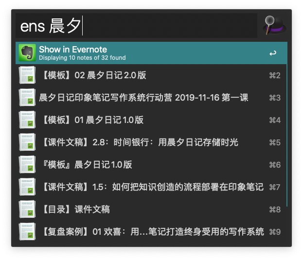
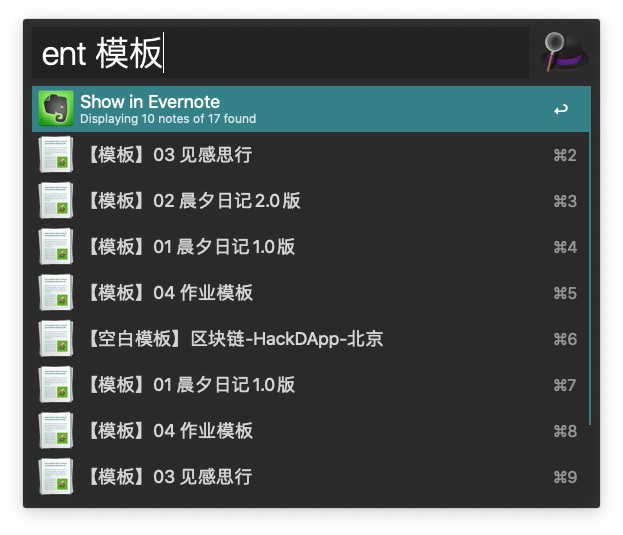
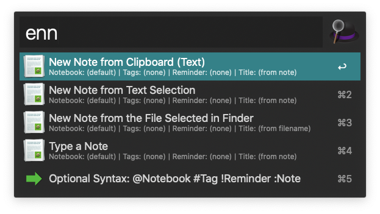
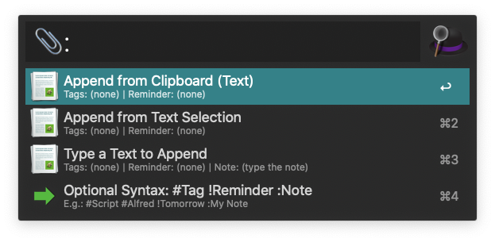

# Alfred4 Workflow for 印象笔记

MacOS 上印象笔记的 Alfred4 workflow

一般情况下，[**点此下载**](https://github.com/hexid26/YinxiangWorkflowAlfred4/raw/master/Yinxiang.alfredworkflow)

```plain
MD5sum : 2747f3667832ac5b52530f35e3787a07
```

## 功能简览

**●　搜索笔记**

- 通用检索 `ens` (匹配内容or标题)



- 标题检索 `ent` (匹配标题 only)



- 新建笔记 `enn` (再选择新建模式)



- 笔记追加 `⌘↩` (选择一条搜所出来的笔记再按快捷键)



- 显示帮助 `en?`

---

## 简要说明

1. 这个 workflow 来源于 [Alfred](https://www.alfredapp.com) 的[官方论坛](https://www.alfredforum.com/topic/840-evernote-workflow-9-beta-4-alfred-4/)。
2. 我的平台 MacOS（Catalina 10.15.1 19B88）、Alfred4（4.0.6 beta 1124）、印象笔记（9.2.1 458835 App Store）
3. 使用 Alfred4 的 workflow 功能需要购买 PowerPack，几百块吧

---

## 关于本 workflow

Alfred 的官方论坛有大神做了 `Evernote` 的 workflow，但是不适配`印象笔记`，所以修改了一下脚本里面的调用，让其支持且仅支持`印象笔记`。如果需要的是`Evernote`的 workflow，请移步[官方论坛](https://www.alfredforum.com/topic/840-evernote-workflow-9-beta-4-alfred-4/)。

PS:
我只是让其在`印象笔记`上可用，不保证 bug 修复。（自用，除非自己有需求修改，否则不改动）
